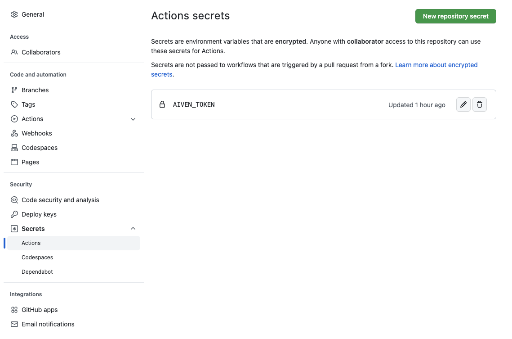

# GH Action for Aiven Terraform Provider

This repo demonstrate how to use Github Actions to apply Terraform configuration files and create resources in your Aiven account. 

## Set your Aiven token

Be sure to have an Aiven auth token ready, go to your github settings -> Secrets -> Actions , and a new secret named `AIVEN_TOKEN`.

## Push to test

Push a new terraform configuration file or update the existing one and you should see the GH Action start running and services appearing on your Aiven Console.

